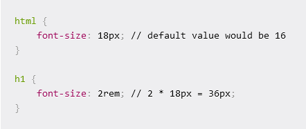

# rem-calculator

### REM unit in CSS

1rem takes on the value which is given to the font-size of the root element. This means that 1 REM keeps the same value throughout your whole CSS code. If the root element's font size is not changed by the user this value is normally 16px. 

